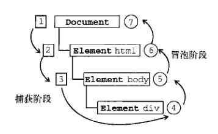
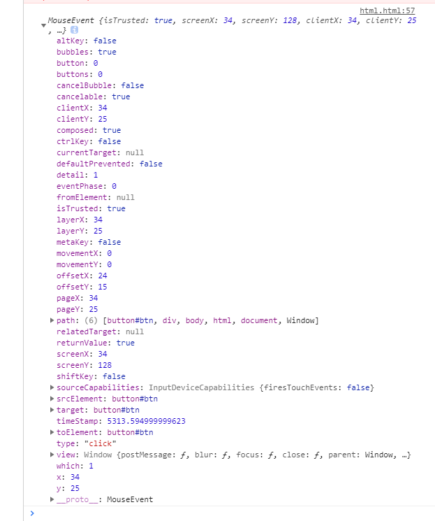

#### 定义

《JavaScript高级程序设计》一书中这样定义：
事件，就是文档或浏览器窗口中发生的一些特定的交互瞬间。可以使用侦听器（或处理程序）来预订事件，以便事件发生时执行相应的代码。这种在传统软件工程中被称为观察员模式的模型，支持页面的行为（JavaScript 代码）与页面的外观（HTML 和 CSS 代码）之间的松散耦合。 
<!--more-->

#### 事件流

事件流描述的是从页面中接收事件的顺序

##### 1.事件冒泡

IE 的事件流叫做事件冒泡（event bubbling），即事件开始时由最具体的元素（文档中嵌套层次最深的那个节点）接收，然后逐级向上传播到较为不具体的节点（文档）。

```html

<!DOCTYPE html>
<html lang="en">

<head>
  <meta charset="UTF-8">
  <meta name="viewport" content="width=device-width, initial-scale=1.0">
  <meta http-equiv="X-UA-Compatible" content="ie=edge">
  <title>event bubbing</title>
</head>

<body>
  <div>
    <button id='btn'>点击</button>
  </div>
</body>

</html>

```
当点击页面中按钮时。click事件会向上传播：

```html
<button>
<div>
<body>
<html>
document
```


##### 2.事件捕获

事件捕获与事件冒泡相反,当发起一个点击事件时。document先获取到click，通过dom树向下传播。

```html
document
<html>
<body>
<div>
<button>

```


#### DOM事件流

“DOM2级事件”规定的事件流包括三个阶段：事件捕获阶段、处于目标阶段和事件冒泡阶段。首先发生的是事件捕获，为截获事件提供了机会。然后是实际的目标接收到事件。最后一个阶段是冒泡阶段，可以在这个阶段对事件做出响应。

#### 事件对象

在触发 DOM 上的某个事件时，会产生一个事件对象 event，这个对象中包含着所有与事件有关的信息。包括导致事件的元素、事件的类型以及其他与特定事件相关的信息。例如，鼠标操作导致的事件对象中，会包含鼠标位置的信息，而键盘操作导致的事件对象中，会包含与按下的键有关的信息。所有浏览器都支持 event 对象，但支持方式不同。

##### event对象

在触发的事件的函数里面我们会接收到一个event对象,通过该对象我们需要的一些参数,比如说我们需要知道此事件作用到谁身上了,就可以通过event的属性target来获取到,或者想阻止浏览器的默认行为可以通过方法preventDefault()来进行阻止。
```html
<!DOCTYPE html>
<html lang="en">

<head>
  <meta charset="UTF-8">
  <meta name="viewport" content="width=device-width, initial-scale=1.0">
  <meta http-equiv="X-UA-Compatible" content="ie=edge">
  <title>event bubbing</title>
</head>

<body>
  <div>
    <button id='btn'>点击</button>
  </div>
</body>
<script>
  let btn = document.querySelector('#btn')
  
  btn.addEventListener('click', function (event) {
    console.log(event)
  })
</script>

</html>
```
通过触发点击事件我们可以获取到一下event属性方法。



| 属性| 描述 |
|:---- |:---------------: |
| altKey |	返回当事件被触发时，”ALT” 是否被按下。|
| button |	返回当事件被触发时，哪个鼠标按钮被点击。|
| clientX |	返回当事件被触发时，鼠标指针的水平坐标。|
| clientY |	返回当事件被触发时，鼠标指针的垂直坐标。|
| ctrlKey |	返回当事件被触发时，”CTRL” 键是否被按下。|
| metaKey |	返回当事件被触发时，”meta” 键是否被按下。|
| relatedTarget |	返回与事件的目标节点相关的节点。|
| screenX |	返回当某个事件被触发时，鼠标指针的水平坐标。|
| screenY |	返回当某个事件被触发时，鼠标指针的垂直坐标。|
| shiftKey |	返回当事件被触发时，”SHIFT” 键是否被按下。|

DOM2级
标准 Event 属性 下面列出了 2 级 DOM 事件标准定义的属性

|属性和方法|	描述 |
|:---- |:---------------:|
|  bubbles |	返回布尔值，指示事件是否是起泡事件类型。|
|  cancelable |	返回布尔值，指示事件是否可拥可取消的默认动作。|
|  currentTarget |	返回其事件监听器触发该事件的元素。|
|  eventPhase |	返回事件传播的当前阶段。|
|  target |	返回触发此事件的元素（事件的目标节点）。|
|  timeStamp |	返回事件生成的日期和时间。|
|  type |	返回当前 Event 对象表示的事件的名称。|
|  initEvent() |	初始化新创建的 Event 对象的属性。|
|  preventDefault() |	通知浏览器不要执行与事件关联的默认动作。|
|  stopPropagation() |	不再派发事件。|
